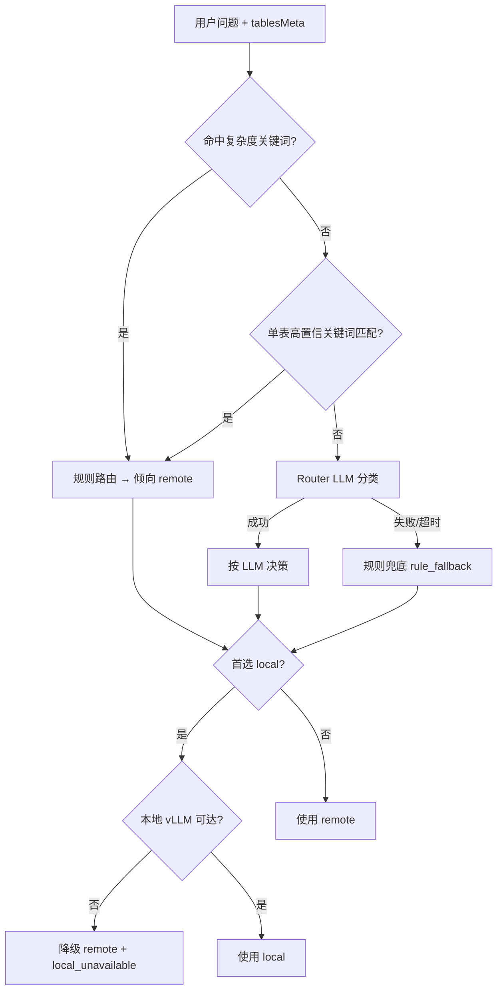

# 问数 · 本地/云端模型路由规则

问数在每次自然语言查数时，会自动选择 **本地 vLLM** 或 **云端 OpenAI 兼容 API** 来生成 SQL 与解读结果。本文档说明完整路由决策链、降级策略与相关环境变量。

---

## 一、路由体系概览

问数存在 **两层独立路由**，请勿混淆：

| 层级 | 路由对象 | 决策依据 | 配置入口 |
|------|----------|----------|----------|
| **数据域路由** | `demo` / `mes` / `mro` | 前端选择的业务域 | `DEFAULT_DOMAIN`、域 API URL |
| **模型路由** | `local` / `remote` | 问题复杂度 + 表规模 + Router LLM | `ROUTER_MODE`、`.env` |

```
用户提问
  │
  ├─► [数据域] demo → SQLite 本地库
  │              mes → MES Data API（HTTP）
  │              mro → MRO Data API（HTTP）
  │
  └─► [模型]  routeModelForQuery()
                ├─ rule / llm / hybrid 决策
                ├─ resolveQueryModel() 解析可用实例
                └─ 本地不可达 → 自动降级云端
```

---

## 二、模型路由模式（`ROUTER_MODE`）

| 模式 | 行为 | 适用场景 |
|------|------|----------|
| `rule` | 仅使用规则引擎（关键词 + 表 tier + 复杂度） | 确定性高、成本低、无 Router LLM 开销 |
| `llm` | 仅使用 Router LLM 分类 | 表元数据复杂、规则难以覆盖 |
| `hybrid`（**默认**） | 高置信规则 + 低置信 LLM + LLM 失败兜底 | 生产推荐，兼顾准确与成本 |

### 2.1 hybrid 模式决策流程（方案 B）



**高置信规则**（跳过 LLM，直接走规则）满足以下任一条件：

1. 关键词 **仅命中一张表**（`keywordMatched.length === 1`）
2. 问题包含 **复杂度信号**（见第三节）

---

## 三、规则路由细则

### 3.1 表关键词匹配

每个业务域的 `tablesMeta` 定义了表名、中文标签、`tier`（`small` / `large`）和关键词列表。

**匹配逻辑：**

1. 将用户问题转小写，与各表 `keywords` 做子串匹配
2. **有命中** → 仅使用命中的表集合做后续判定
3. **无命中** → 使用域内全部表（保守策略，通常含大表 → 倾向 remote）

**Demo 域示例：**

| 表 | tier | 关键词 |
|----|------|--------|
| production_line | small | 产线、车间、产能 |
| work_order | large | 工单、订单、在制 |
| quality_record | large | 良率、质量、不良、抽检 |
| shift_log | large | 班次、oee、停机 |

### 3.2 表规模（tier）判定

```
任一命中表 tier === "large"  →  首选 remote
全部命中表 tier === "small"  →  首选 local
```

### 3.3 复杂度信号（优先 remote）

问题包含以下关键词时，**无论表规模**，规则路由首选 `remote`：

> 对比、比较、关联、join、聚合、排名、top、趋势、同比、环比、交叉、分组统计、占比、比例、汇总、透视

示例：

- 「列出所有产线」→ 单表 small → **local**
- 「各产线产能对比」→ 含「对比」→ **remote**
- 「近 7 天 OEE 趋势」→ 含「趋势」→ **remote**

### 3.4 规则路由理由（`route_reason`）

规则命中时，响应中会附带人类可读理由，例如：

- `单表小表「产线」`
- `涉及大表「工单」`
- `多表查询（工单、良率）`
- `复杂查询（对比/聚合/趋势等）`
- `未命中表关键词，按全表集保守路由`

---

## 四、Router LLM 路由

当 hybrid 模式置信不足，或 `ROUTER_MODE=llm` 时，调用 Router LLM 输出 JSON：

```json
{"model":"local"|"remote","reason":"一句话说明"}
```

**Prompt 规则摘要：**

- 简单单表、small 表、明细少 → `local`
- 多表 JOIN、复杂聚合、large 表、指标口径复杂 → `remote`
- 不确定 → `remote`

**Router LLM 自身运行位置：**

- `ROUTER_USE_LOCAL=true`（默认）：本地 vLLM 可达时用本地跑 Router，否则用 `ROUTER_REMOTE_PROVIDER` 或默认云端
- `ROUTER_TIMEOUT_MS`：默认 15000ms，超时触发规则兜底

---

## 五、模型解析与降级（`resolveQueryModel`）

路由决策给出首选 `local` / `remote` 后，解析器按队列尝试 **首个可用** 模型：

```
1. 路由首选（含用户选择的 remote_provider）
2. 对立类型（local↔remote 互为备选）
3. 所有已配置的云端提供商（qwen / deepseek / openai / custom）
```

| 场景 | 结果 |
|------|------|
| 首选 local，vLLM 不可达 | `remote` + `fallback_reason: local_unavailable` |
| 全部不可用 | `no_model_available`，以 chat 模式友好回复 |

**本地可达探测：** `GET {LOCAL_BASE_URL}/models`，超时 3 秒。

---

## 六、分阶段模型（`SPLIT_MODEL_INTERPRET`）

| 配置 | SQL 生成 | 结果解读 |
|------|----------|----------|
| `false`（默认） | 路由选定模型 | 同模型 |
| `true` | 路由选定模型 | **强制云端**（独立解析可用提供商） |

前端 `ModelBadge` 在 split 模式下分别展示 SQL / 解读所用模型。

---

## 七、闲聊与无模型兜底

| 场景 | 行为 |
|------|------|
| 纯问候（「你好」「帮助」等） | 跳过 SQL，用云端模型对话回复 |
| 无任何可用模型 | `response_mode: chat`，提示检查 vLLM / API Key |

---

## 八、环境变量速查

| 变量 | 默认值 | 说明 |
|------|--------|------|
| `LOCAL_BASE_URL` | — | 本地 vLLM OpenAI 兼容端点 |
| `LOCAL_MODEL_NAME` | `Qwen3.5-27B` | 本地模型名 |
| `REMOTE_PROVIDER` | `deepseek` | 默认云端提供商 |
| `ROUTER_MODE` | `hybrid` | `rule` / `llm` / `hybrid` |
| `ROW_THRESHOLD` | `10000` | 旧版 demo 行数阈值（`routeModel` 遗留路径） |
| `ROUTER_USE_LOCAL` | `true` | Router LLM 是否优先本地 |
| `ROUTER_TIMEOUT_MS` | `15000` | Router LLM 超时 |
| `SPLIT_MODEL_INTERPRET` | `false` | SQL/解读分模型 |
| `LLM_TIMEOUT_MS` | `60000` | 主查询 LLM 超时 |

前端通过 `GET /api/health` 的 `router` 字段只读展示当前配置。

---

## 九、响应字段说明

成功查询响应中与路由相关的字段：

| 字段 | 类型 | 含义 |
|------|------|------|
| `model_used` | `local` \| `remote` | SQL 生成实际使用 |
| `model_name` | string | 模型名称 |
| `interpret_model_used` | 可选 | split 模式下解读模型 |
| `route_source` | `rule` \| `llm` \| `rule_fallback` | 决策来源 |
| `route_reason` | string? | 路由理由（规则或 LLM） |
| `fallback_reason` | `local_unavailable` \| `no_model_available`? | 降级原因 |

---

## 十、示例走查

### 示例 1：「列出所有产线」

1. hybrid → 单表命中 `production_line`（small）→ **规则路由**
2. 首选 **local** → vLLM 可达 → 使用本地 Qwen3.5-27B
3. `route_source: rule`，`route_reason: 单表小表「产线」`

### 示例 2：「统计工单完成率」

1. 命中 `work_order`（large）→ 规则高置信
2. 首选 **remote** → 使用用户选择的 DeepSeek
3. `route_reason: 涉及大表「工单」`

### 示例 3：「随便问问」（无关键词）

1. hybrid → 低置信 → **Router LLM**
2. LLM 返回 `remote` + 理由 → 使用云端
3. 若 LLM 超时 → `rule_fallback`，按全表 conservative 路由

### 示例 4：本地 vLLM 宕机

1. 规则判定 local
2. `isLocalModelAvailable()` 失败
3. 自动切换 remote，`fallback_reason: local_unavailable`

---

## 相关代码

| 模块 | 路径 |
|------|------|
| 路由核心 | `packages/server/src/chains/modelRouter.ts` |
| 查询链集成 | `packages/server/src/chains/buildChain.ts` |
| 健康检查 | `packages/server/src/routes/health.ts` |
| 前端展示 | `packages/web/src/components/ModelBadge.vue` |
| 单元测试 | `packages/server/tests/modelRouter.test.ts` |
