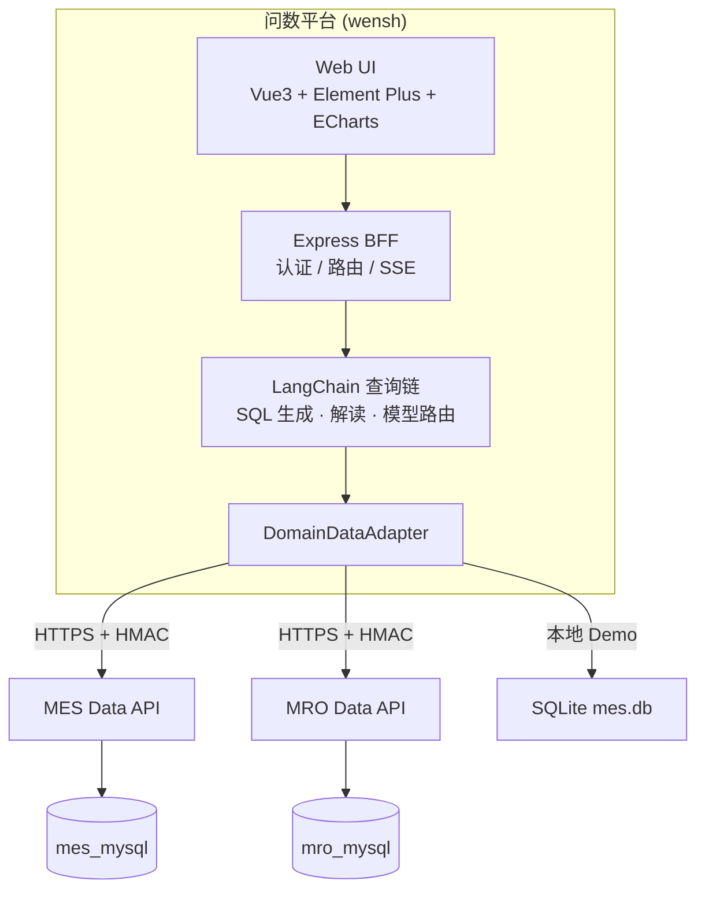
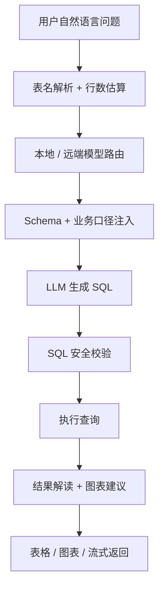
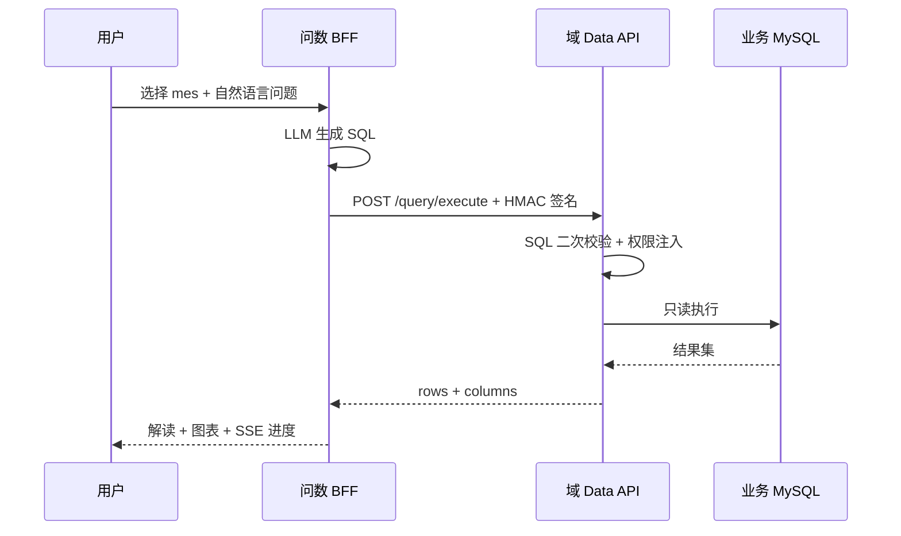
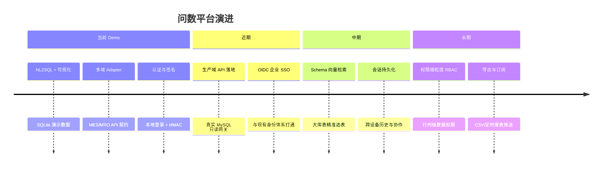

# 问数 · WenShu

制造数据 **自然语言查数** 平台

<div class="pt-4 opacity-80 text-lg">
MES / MRO 多业务域 · 本地与云端模型智能路由 · 可对接企业域 Data API
</div>

<div class="abs-br m-6 text-sm opacity-50">
2026 · 内部汇报材料
</div>

---
layout: default
---

# 议程

<div class="mt-8 text-left max-w-2xl mx-auto text-lg leading-relaxed">

1. **背景与痛点** — 为什么需要问数  
2. **产品定位与价值** — 解决什么问题  
3. **系统架构与查询链路** — 技术如何落地  
4. **核心能力** — 模型路由、多域对接、安全合规  
5. **演示场景** — 典型问法与产出  
6. **演进路线** — 从 Demo 到生产化  

</div>

---
layout: two-cols
---

# 业务背景

## 制造现场的数据困境

::left::

<div class="text-left space-y-4 mt-4">

- 报表与 BI 门槛高，**业务人员难以自助取数**
- MES / MRO 等系统 **库表分散、口径不统一**
- 临时分析依赖研发写 SQL，**响应慢、成本高**
- 大模型普及后，**自然语言查数** 成为可行路径

</div>

::right::

<div class="wensh-card text-left mt-4">

### 典型场景

| 角色 | 诉求 |
|------|------|
| 生产主管 | 「上个月哪条产线良率最低？」 |
| 设备工程师 | 「近 30 天停机时长 Top 5 设备？」 |
| 管理层 | 「今年工单完成率趋势如何？」 |

</div>

<div class="mt-4 text-sm opacity-70 text-left">
问数将 **口语化问题** 转为 **可审计的 SQL + 可视化结果**
</div>

---
layout: center
class: text-center
---

# 产品定位

<div class="mt-6 text-xl max-w-3xl mx-auto leading-relaxed opacity-90">

**面向制造与运维场景的智能数据问答平台**  
用自然语言提问 → 自动生成并执行只读查询 → 解读结果并推荐图表

</div>

<div class="wensh-grid-3 mt-10 max-w-4xl mx-auto text-sm">

<div class="wensh-card">
<div class="wensh-tag mb-2">NL2SQL</div>
大模型理解业务口径，生成标准 SQL
</div>

<div class="wensh-card">
<div class="wensh-tag mb-2">BFF 聚合</div>
统一入口对接多业务域 Data API
</div>

<div class="wensh-card">
<div class="wensh-tag mb-2">可观测</div>
流式进度、Token 统计、模型来源标识
</div>

</div>

---
layout: default
---

# 核心价值

<div class="wensh-grid-2 mt-6 text-left text-base">

<div class="wensh-card">
<h3 class="text-blue-700 mb-2">降本增效</h3>
业务人员自助查数，减少研发排期与重复取数
</div>

<div class="wensh-card">
<h3 class="text-blue-700 mb-2">数据解耦</h3>
问数平台不直连业务库，经各域 Data API 统一只读出口
</div>

<div class="wensh-card">
<h3 class="text-blue-700 mb-2">安全可控</h3>
SQL 白名单校验、域侧二次校验、HMAC 服务间签名
</div>

<div class="wensh-card">
<h3 class="text-blue-700 mb-2">灵活扩展</h3>
新增业务域 = 配置 + 域 API 实现，核心查询链无需改动
</div>

</div>

---
layout: default
---

# 系统架构



<div class="text-sm opacity-70 mt-2">
设计原则：<strong>Adapter 模式</strong> · <strong>域 API 统一契约</strong> · <strong>配置驱动多域</strong>
</div>

---
layout: two-cols
---

# 查询链路

::left::



::right::

<div class="text-left mt-4 space-y-3 text-sm">

### 关键保障

- 仅允许 **SELECT**，拒绝 DML/DDL/多语句
- 执行失败可 **自动重试 1 次**（带错误上下文）
- 支持 **轻量多轮**（最近 2 轮 SQL 上下文）
- **SSE 流式** 展示生成与执行进度

### 业务指标口径（示例）

| 指标 | 规则 |
|------|------|
| 良率 | `AVG(yield_rate)` |
| 工单完成率 | `SUM(actual)/SUM(planned)` |
| OEE | `AVG(oee)` |

</div>

---
layout: default
---

# 产品能力一览

| 能力 | 说明 |
|------|------|
| 自然语言问数 | 中文提问，自动生成 SQL 并执行 |
| 多业务域 | `demo`（SQLite）/ `mes` / `mro` 页头切换 |
| 智能模型路由 | 按数据量选择本地 vLLM 或远端 API，本地不可达自动降级 |
| 多模型提供商 | Qwen · DeepSeek · OpenAI · 自定义 OpenAI 兼容接口 |
| 结果可视化 | ECharts 柱状图/折线图，自动推荐 chart 类型 |
| 会话与示例 | 示例问题、新对话、Token 用量统计 |
| 企业认证 | 本地账号 / OIDC SSO（预留） |
| 域 API 对接 | OpenAPI 契约 + HMAC `X-Wensh-*` 签名 |

---
layout: two-cols
---

# 智能模型路由

::left::

<div class="text-left mt-4">

### 路由策略

1. 根据问题关键词解析 **涉及数据表**
2. 查询各表行数，取 **最大值**
3. 超过 `ROW_THRESHOLD` → **远端大模型**
4. 否则优先 **本地 vLLM**（如 Qwen3.5-27B）
5. 本地不可达 → **自动降级远端**

</div>

<div class="wensh-card text-left mt-4 text-sm">

**价值**：敏感/小查询走本地降本；大表复杂分析走远端保质量

</div>

::right::

```ts {monaco}
// modelRouter 核心逻辑（简化）
const maxCount = maxRowCount(tables);
const preferred =
  maxCount > ROW_THRESHOLD ? "remote" : "local";

if (preferred === "local" && !await isLocalAvailable()) {
  return { type: "remote", fallback: "local_unavailable" };
}
return { type: preferred };
```

<div class="text-xs opacity-60 mt-2 text-left">
前端 ModelBadge 展示本次使用的模型来源
</div>

---
layout: default
---

# 多业务域对接

<div class="mt-4">



</div>

<div class="text-sm mt-4 opacity-80">
契约文档：<code>docs/superpowers/specs/domain-data-api.openapi.yaml</code> · 域团队对接指南已提供
</div>

---
layout: two-cols
---

# 安全与合规

::left::

<div class="text-left space-y-3 mt-4">

### 问数平台侧

- `AUTH_ENABLED` 登录门禁（演示账号可配置）
- SQL **白名单**：仅 SELECT
- 服务间 **Bearer Token** + **HMAC 签名**
- 预留 **OIDC** 企业 SSO

### 域 API 侧（推荐）

- 二次 SQL 校验与 **行级权限**
- 独立 MySQL 只读账号
- 审计日志与 `X-Trace-Id` 全链路追踪

</div>

::right::

<div class="wensh-card text-left mt-6 text-sm">

### 为什么不让问数直连业务库？

| 方案 | 结论 |
|------|------|
| 问数直连 MySQL | ❌ 凭证分散、安全边界差 |
| 每问题一个 REST | ❌ 维护成本极高 |
| **SQL 执行网关 API** | ✅ 已采用 |

</div>

---
layout: default
---

# 技术栈

<div class="wensh-grid-2 mt-6 text-left text-sm">

<div>

### 后端

- **Express** + TypeScript（strict）
- **LangChain.js** 查询链
- **node:sqlite** / HTTP Domain Adapter
- **Vitest** 单元与集成测试

</div>

<div>

### 前端

- **Vue 3** + Vite
- **Element Plus** + Tailwind CSS v4
- **ECharts** 图表
- **SSE** 流式查询进度

</div>

<div>

### 工程

- **pnpm monorepo**（shared / server / web）
- 前后端类型 **`@wensh/shared`** 统一
- 一键 `pnpm dev` 启动全栈

</div>

<div>

### 模型

- 本地：**vLLM** OpenAI 兼容接口
- 远端：Qwen / DeepSeek / OpenAI 等
- 页面可切换，偏好 **localStorage** 持久化

</div>

</div>

---
layout: default
---

# 演示场景

<div class="mt-4 text-left text-base">

### 推荐演示流程（约 5 分钟）

1. 登录 → 选择业务域 **demo** → 查看健康状态  
2. 点击示例：「上个月哪条产线的平均良率最低？」  
3. 展示 **流式进度** → 展开 **SQL** → **表格 + 柱状图**  
4. 追问：「那 B 线呢？」（轻量多轮）  
5. 切换 **远端模型提供商**，对比响应与 Token  
6. （可选）切换 **mes** 域，说明对接真实 Data API  

</div>

<div class="wensh-card mt-6 text-sm text-left">

```bash
pnpm install && cp .env.example .env
pnpm seed && pnpm dev
# Web: http://localhost:5173  ·  API: http://localhost:3000
```

演示账号：`demo` / `demo123`（`AUTH_ENABLED=true` 时）

</div>

---
layout: default
---

# 演进路线



---
layout: center
class: text-center
---

# 总结

<div class="mt-8 text-lg max-w-2xl mx-auto leading-relaxed opacity-90">

问数将 **大模型能力** 与 **制造数据治理** 结合：  
业务问得快、技术控得住、架构扩得开。

</div>

<div class="mt-10 text-base opacity-70">

仓库：`wensh` · 设计文档 `wensh-plan.md` · 域对接 `docs/domain-api-integration-guide.md`

</div>

---
layout: end
class: text-center
---

# 谢谢

## Q & A

<div class="mt-8 text-lg opacity-80">
欢迎就落地节奏、域 API 排期、模型选型与成本模型进一步讨论
</div>

<div class="abs-br m-6 flex gap-2 text-sm opacity-50">
<span class="wensh-tag">Slidev</span>
<span class="wensh-tag">WenShu</span>
</div>
